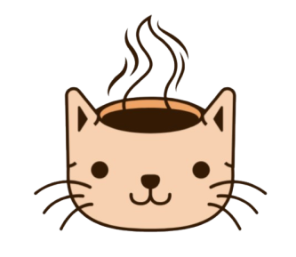

# CSOneCup Server

[![Contributors][contributors-shield]][contributors-url]
[![Forks][forks-shield]][forks-url]
[![Stargazers][stars-shield]][stars-url]
[![Issues][issues-shield]][issues-url]
[![MIT License][license-shield]][license-url]  
<br />

<div align="center">
  <a href="https://github.com/CSOneCup/CSOneCup-server">
    
  </a>


  <h3 align="center">CSOneCup</h3>

  <p align="center">
    A gamified platform for learning computer science effectively and enjoyably.
    <br />
    <a href="https://github.com/CSOneCup/CSOneCup-server"><strong>Explore the docs »</strong></a>
    <br />
    <br />
    <a href="https://github.com/CSOneCup/CSOneCup-server">View Repository</a>
    ·
    <a href="https://github.com/CSOneCup/CSOneCup-server/issues/new?labels=bug&template=bug-report---.md">Report Bug</a>
    ·
    <a href="https://github.com/CSOneCup/CSOneCup-server/issues/new?labels=enhancement&template=feature-request---.md">Request Feature</a>
    ·
    <a href="https://github.com/CSOneCup/CSOneCup-client">View Client</a>
  </p>
</div>


## Introduction

**CSOneCup** is a gamified platform designed to make learning computer science (CS) knowledge both engaging and effective. By integrating CS quizzes into a fun and interactive card format, the platform aims to cater to different audiences:

- **Job Seekers**: Effortlessly prepare for technical interviews and coding tests while managing time effectively.
- **CS Students**: Build a deeper understanding of CS subjects without the stress of traditional study methods.
- **Junior Developers**: Continue professional growth while enjoying a gamified learning experience.

CSOneCup empowers users by providing them with the ability to:
- Test and validate their knowledge through quizzes.
- Focus on weak areas by targeting specific categories.
- Create custom decks to share and compete with others.

The platform turns learning into a rewarding and motivating experience through friendly competition and personalization.  
<br />

## Key Features

### Main Features

- **CS Quiz Cards**  
  Each problem is presented as a card with the question on the front and the answer (with explanations) on the back.
  
- **Random Problem Solving**  
  Users can solve random questions or select specific categories to focus on their interests.

- **Custom Deck Building**  
  Users can create personalized decks using owned cards, set categories and time limits, and share them with others to compete.

### Additional Features

- **Competitive Element**  
  A rating and ranking system to encourage users to compete and measure their progress against others.

- **Card Design Customization**  
  Unlock and apply design elements to personalize cards and decks, such as colors, animations, and styles.

- **Quiz Reminders**  
  Notifications to remind users of their scheduled learning times, with quick-access widgets for solving quizzes directly.  
  <br />

## Design


<br />

## Getting Started

### Prerequisites

#### For Server (Spring Boot)
1. **Java Development Kit (JDK) 17**:
   - Install JDK 17 from [Oracle](https://www.oracle.com/java/technologies/javase-jdk17-downloads.html) or use your package manager:
     ```sh
     sudo apt install openjdk-17-jdk
     ```
2. **Gradle**:
   - Install Gradle if not bundled with the project:
     ```sh
     sudo apt install gradle
     ```

#### For Client (Flutter)
1. **Flutter SDK**:
   - Install Flutter SDK from [Flutter Official Site](https://flutter.dev/docs/get-started/install).
   - Verify installation:
     ```sh
     flutter doctor
     ```
2. **Dart SDK**:
   - Included with Flutter, no separate installation required.
3. **Android Studio or Xcode** (For Device Emulation and Building Apps):
   - Install [Android Studio](https://developer.android.com/studio) for Android development or Xcode for iOS development.
   - Ensure required plugins (Flutter and Dart) are installed in your IDE.
<br />  

### Installation

#### Server Setup (Spring Boot)

1. Clone the repository:
   ```sh
    git clone https://github.com/CSOneCup/CSOneCup-server.git
   ```
2. Navigate to the project directory:
   ```sh
   cd CSOneCup-server
   ```
3. Build the project:
   ```sh
   ./gradlew build
   ```
4. Run the Spring Boot server:
   ```sh
   ./gradlew bootRun
   ```

#### Client Setup (Flutter)

1. Clone the repository:
   ```sh
   git clone https://github.com/CSOneCup/CSOneCup-client.git
   ```
2. Navigate to the Flutter project directory:
   ```sh
   cd CSOneCup-client
   ```
3. Install dependencies:
   ```sh
   flutter pub get
   ```
4. Run the Flutter application:
   ```sh
   flutter run
   ```
<br />  

## Team Members

<div style="overflow-x: auto;">
  <table style="min-width: 800px; table-layout: fixed; text-align: center;">
    <tr>
      <td align="center">
        <br>
        <a href="https://github.com/JHoon0214"><b>김재훈</b></a><br>
        서버 개발 & 회원 인증 로직 개발
      </td>
      <td align="center">
        <br>
        <a href="https://github.com/SHKim55"><b>김선호</b></a><br>
        메인 메뉴 개발 & 챌린지 개발
      </td>
      <td align="center">
        <br>
        <a href="https://github.com/EpicFn"><b>김혁진</b></a><br>
        퀴즈 로직 개발
      </td>
      <td align="center">
        <br>
        <a href="https://github.com/ja7811"><b>현재환</b></a><br>
        카드 관리 & 덱 생성 로직 개발
      </td>
    </tr>
  </table>
</div>

우리 팀은 **컴퓨터과학 학습의 재미와 효과를 동시에 제공하는 플랫폼**을 만들기 위해 모였습니다. 💪


[contributors-shield]: https://img.shields.io/github/contributors/CSOneCup/CSOneCup-server.svg?style=for-the-badge
[contributors-url]: https://github.com/CSOneCup/CSOneCup-server/graphs/contributors
[forks-shield]: https://img.shields.io/github/forks/CSOneCup/CSOneCup-server.svg?style=for-the-badge
[forks-url]: https://github.com/CSOneCup/CSOneCup-server/network/members
[stars-shield]: https://img.shields.io/github/stars/CSOneCup/CSOneCup-server.svg?style=for-the-badge
[stars-url]: https://github.com/CSOneCup/CSOneCup-server/stargazers
[issues-shield]: https://img.shields.io/github/issues/CSOneCup/CSOneCup-server.svg?style=for-the-badge
[issues-url]: https://github.com/CSOneCup/CSOneCup-server/issues
[license-shield]: https://img.shields.io/github/license/CSOneCup/CSOneCup-server.svg?style=for-the-badge
[license-url]: https://github.com/CSOneCup/CSOneCup-server/blob/main/LICENSE
